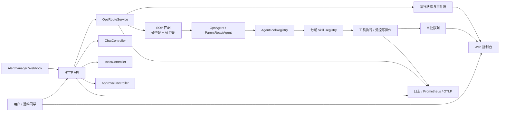
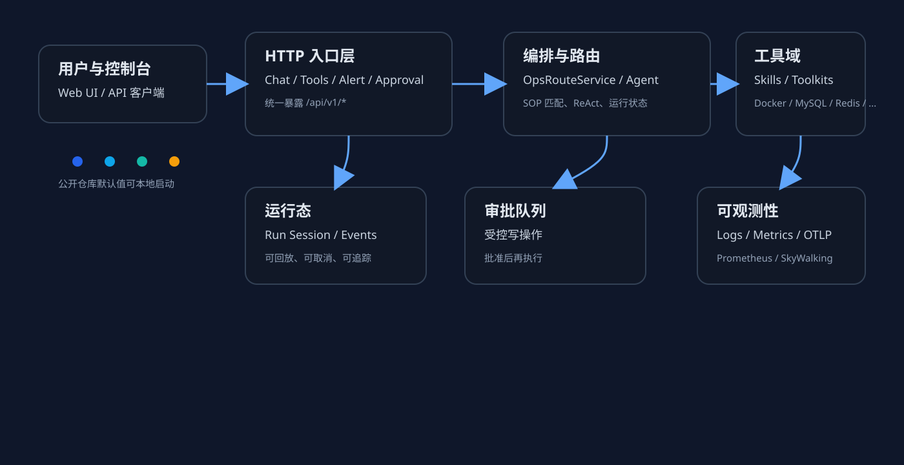
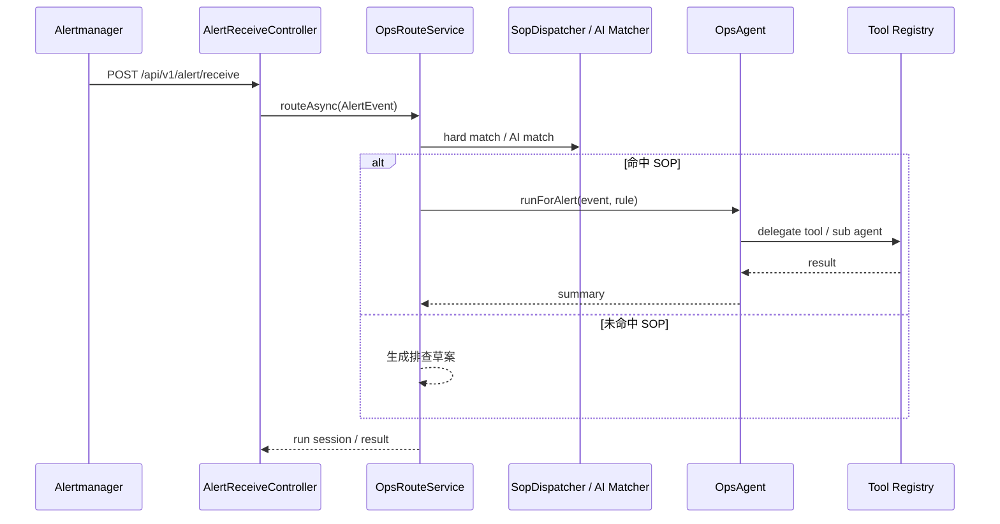
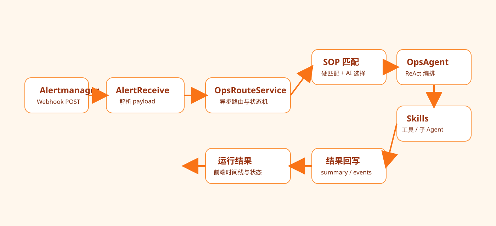
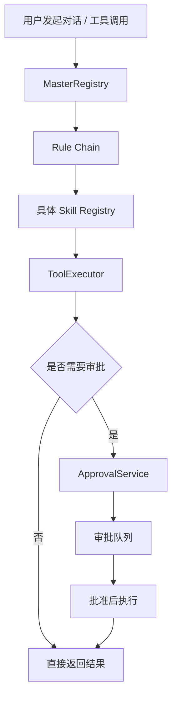
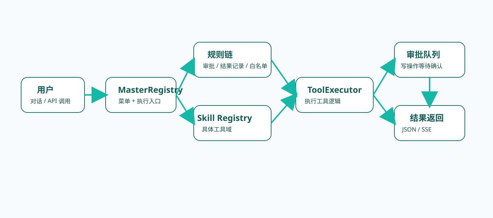

# ops-agent-spring-ai

一个面向个人 GitHub 展示的 Spring AI 运维 Agent 项目。

它把“告警接入、SOP 匹配、工具执行、审批流、子 Agent 委派、可观测性”放在同一个应用里，适合展示一个完整的运维智能体如何在真实系统里工作。

## 项目亮点

- Spring Boot + Spring AI Alibaba 实现的运维 Agent
- SOP 驱动的告警处理链路，支持规则匹配和 AI 辅助匹配
- 进程内工具体系，覆盖 Docker、MySQL、Redis、Nacos、RocketMQ、Prometheus、Elasticsearch
- 审批流支持受控写操作，适合展示“安全可控的自动化”
- 独立 Web 控制台，能直接演示对话、工具调用、审批队列和运行时间线
- 可观测性接入了日志、Prometheus、OpenTelemetry / SkyWalking 相关链路

## 总体架构





## 核心流程

### 1. 告警处理流程





### 2. 工具执行流程





## 模块说明

- `trigger/`：HTTP 入口层，负责聊天、工具、告警、审批和运行查询
- `service/`：编排层，负责路由、SOP 匹配、审批和运行状态管理
- `agent/`：ReAct 编排与子 Agent 委派
- `skill/`：具体工具域，实现每个技能域的 registry 与 toolkit
- `domain/`：运行态、告警、审批等领域对象
- `infrastructure/`：配置、日志、追踪、SOP 外部加载
- `dev-ops/frontend/`：独立 Web 控制台

## 前端页面

- 前端目录：`dev-ops/frontend/`
- Docker 默认访问：
  - `http://127.0.0.1:8089/`
  - `http://127.0.0.1:8089/runs.html`
  - `http://127.0.0.1:8089/approvals.html`
  - `http://127.0.0.1:8089/tools.html`
- 前端默认通过 Gateway 访问 API：`http://127.0.0.1:8090/gw/api/v1/ops-ai`

## 运行方式

### 1. 准备本地配置

复制模板文件：

```bash
cp application-local.example.yml application-local.yml
```

`application-local.yml` 已加入 `.gitignore`，适合填写你自己的密钥和地址。

### 2. 设置模型 Key

```bash
export DASHSCOPE_API_KEY=your-key
```

### 3. 启动应用

```bash
mvn spring-boot:run
```

默认端口：`8096`

### 4. 启动前端

使用 Docker Compose：

```bash
docker compose -f ../dev-ops/docker-compose-apps-test.yml up -d ops-agent-frontend gateway ops-agent-spring-ai
```

## API 概览

| 方法 | 路径 | 说明 |
|------|------|------|
| POST | `/api/v1/chat/stream` | SSE 流式对话 |
| POST | `/api/v1/chat/react` | 父 Agent ReAct 调试入口 |
| POST | `/api/v1/tools/execute` | 执行工具 |
| POST | `/api/v1/alert/receive` | Alertmanager webhook |
| GET | `/api/v1/approvals/pending` | 待审批列表 |
| POST | `/api/v1/approvals/{id}/approve` | 审批通过 |
| POST | `/api/v1/approvals/{id}/reject` | 拒绝审批 |
| POST | `/api/v1/ops/route-text` | 纯文本路由 |
| GET | `/api/v1/ops/runs/{runId}` | 查看运行状态 |
| GET | `/api/v1/ops/runs/{runId}/events` | 运行事件流 |
| POST | `/api/v1/ops/runs/{runId}/cancel` | 取消运行 |

## 文档入口

- [DevOps 总入口](dev-ops/README.md)
- [ops-agent 文档索引](dev-ops/docs/ops-agent/README.md)
- [项目架构](dev-ops/docs/ops-agent/architecture.md)
- [API 与运行说明](dev-ops/docs/ops-agent/api.md)
- [部署与配置](dev-ops/docs/ops-agent/deployment.md)
