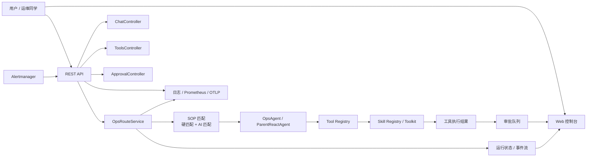
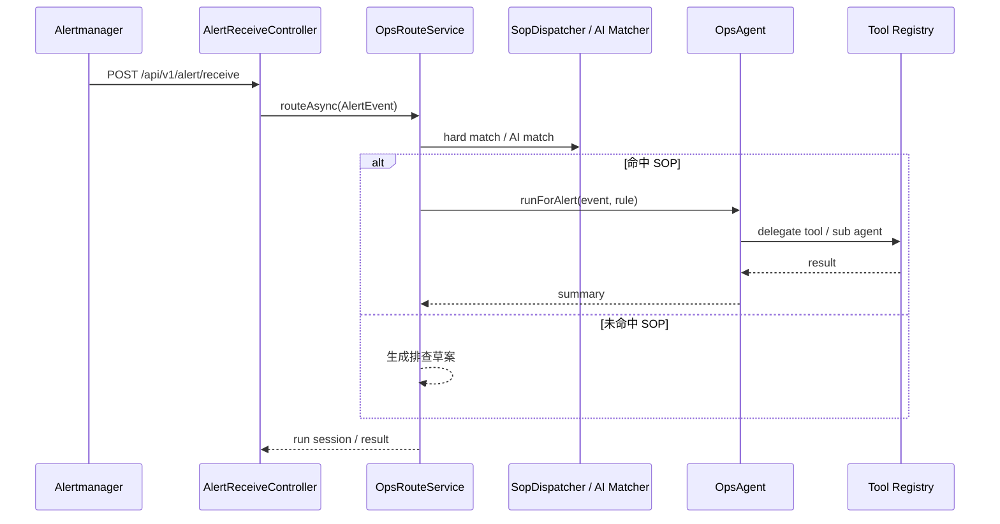
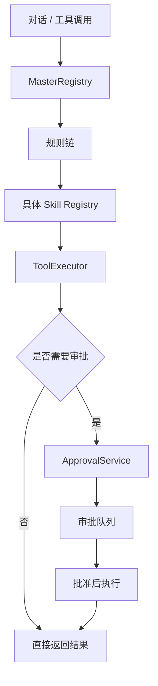

# 项目架构

`ops-agent-spring-ai` 是一个面向运维场景的 Spring AI Agent 应用，核心目标不是“聊天演示”，而是把真实运维动作串成可解释、可审批、可追踪的自动化链路。

## 架构总览

## 组件职责

- `trigger`：HTTP 入口层，负责聊天、工具、告警、审批和运行查询
- `service`：业务编排层，负责路由、SOP 匹配、审批、运行状态管理
- `agent`：ReAct 编排层，负责父 Agent 与子 Agent 的委派
- `skill`：工具域实现层，按技能域组织 registry / toolkit
- `domain`：告警、审批、路由、运行态等领域对象
- `infrastructure`：配置、日志、追踪、SOP 外部加载
- `dev-ops/frontend`：独立部署的 Web 控制台

## 核心流转

### 告警流

### 工具流

## 设计原则

- 单一入口，多条编排路径
- 读操作默认直接执行，写操作必须经过审批
- SOP 优先，AI 兜底
- 每次执行都带运行轨迹，方便回放和排障
- 公开仓库默认值全部可本地启动，不包含内网地址或密钥
